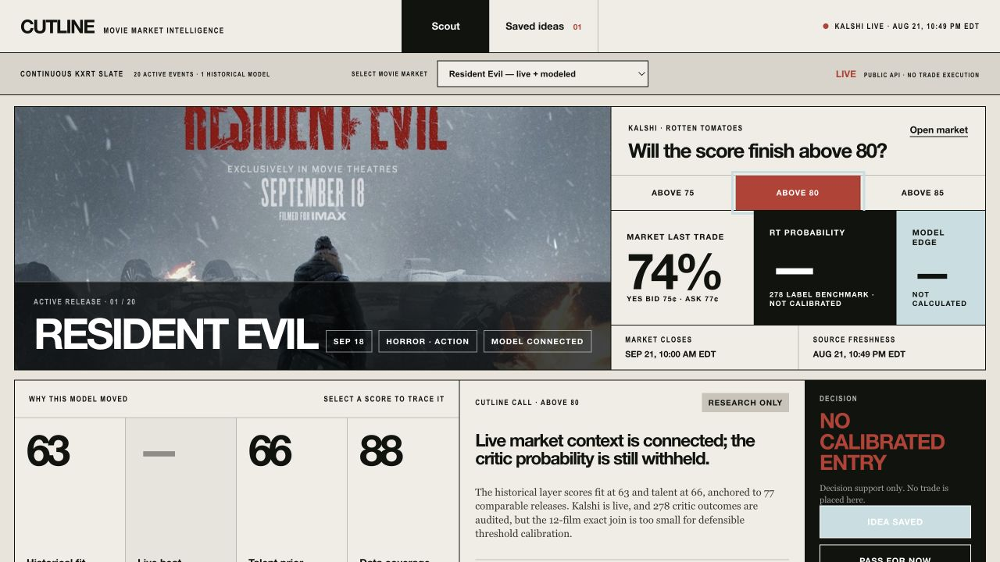
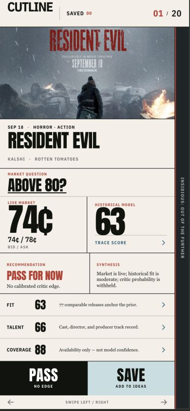
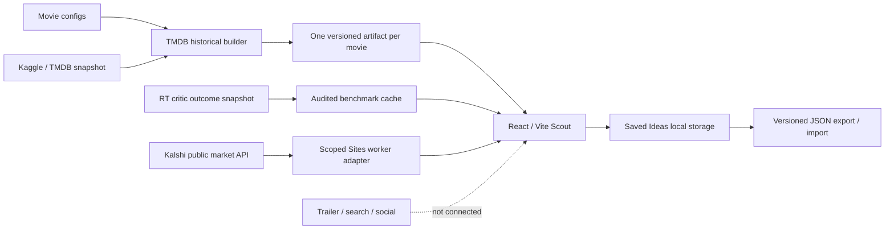

# Cutline

**Explainable movie-market intelligence for researching how upcoming releases may perform.**

Cutline brings a continuously refreshed slate of movie prediction markets, historical evidence, and research decisions into one cinematic desktop frame and a one-card mobile swipe deck. Instead of returning a mysterious score, it lets a user open every signal and inspect the sample, weights, contribution, freshness, comparable films, and source provenance behind it.

[Current Sites preview](https://cutline-movie-market.cheicolate.chatgpt.site/) · [Architecture](docs/architecture.md) · [Historical methodology](docs/historical-data.md) · [Contributing](CONTRIBUTING.md)

> **Repository status:** `main` contains the configuration-driven historical pipeline, audited critic benchmark, public Kalshi market adapter, and portable Saved Ideas workflow. Resident Evil remains the first fully modeled fixture; other active KXRT events appear as truthful **live market only** states until a movie configuration is generated.





## Why Cutline exists

Movie prediction markets are easy to look at and surprisingly hard to reason about. A contract price alone does not explain:

- whether the director, cast, producers, genre, franchise, and release window have useful historical priors;
- how many films support each prior;
- whether a signal is genuinely current or simply stale;
- whether a model is using information that would not have been available before release; or
- why a trade idea should be saved, watched, or passed.

Cutline is designed to make that reasoning visible. It is a research and decision-support product—not an automated trader and not a promise of returns.

## Product experience

The current prototype supports a repeatable multi-movie research loop:

1. **Select or swipe to an active movie market.** The KXRT slate comes from Kalshi's public, unauthenticated market-data API and refreshes every 60 seconds while the application is open. On mobile, swipe left to pass or right to save and advance; the visible buttons provide the same actions.
2. **Orient on the release.** See configured movie art and historical context when available; unconfigured events remain visibly market-only.
3. **Inspect the evidence.** Open Historical fit, Live heat, Talent prior, or Data coverage to trace the underlying evidence and source status.
4. **Read the synthesis.** Cutline explains what the historical and critic layers support and what they cannot yet conclude.
5. **Make a research decision.** Save the idea or pass without placing a trade.
6. **Share research.** Saved Ideas persist locally and can be exported or merged from a versioned teammate JSON file.

### Current test case

The first end-to-end case is the Kalshi market for whether **Resident Evil** finishes above a selected Rotten Tomatoes threshold.

| Visible output | Current value | What it means |
| --- | ---: | --- |
| Historical fit | 63.2, displayed as 63 | Weighted historical context from director, producers, franchise, genre cohort, and September releases |
| Live heat | Unavailable as a composite score | Kalshi prices are live context; critic calibration, trailer, search, and social scoring are not validated |
| Talent prior | 65.5, displayed as 66 | Historical prior from first-billed cast, director, and producer filmographies |
| Data coverage | 87.9, displayed as 88 | Availability of the required historical fields; **not** model confidence |
| Rotten Tomatoes outcome benchmark | 278 eligible films | Audited historical labels with at least five critic reviews; benchmark only |
| Rotten Tomatoes probability | Unavailable | Only 12 exact title/year rows join to the TMDB snapshot, which is insufficient for time-aware calibration |
| Model edge / entry | Unavailable | Cutline will not calculate an edge from mismatched outcome labels |

## What is real today

| Surface | Status | Source or storage |
| --- | --- | --- |
| Movie, cast, director, producer, genre, release, budget, revenue, and rating history | Connected historical snapshot | Kaggle/TMDB, February 17, 2026 |
| Historical score calculations | Connected and reproducible | Python standard-library pipeline |
| Comparable-film cohort | Connected | 77 English-language Horror + Science Fiction releases |
| Movie-specific score rationales | Connected for configured movies | Checked-in normalized JSON artifacts under `src/data/markets/` |
| Active Rotten Tomatoes market slate | Connected live at runtime | Kalshi public market-data API through a scoped Sites worker route |
| Rotten Tomatoes critic outcomes | Connected as a benchmark | 278 eligible labels from a July 18, 2025 snapshot |
| Critic probability calibration | Not validated | Only 12 exact title/year joins; no probability is produced |
| Trailer, search, and social indicators | Not connected | No placeholder values are produced |
| Saved Ideas | Connected locally and portable | Browser `localStorage` plus versioned JSON export/import |
| Team accounts and shared idea storage | Not connected | No authentication or database exists yet |
| Trade execution | Intentionally unsupported | Decision support only |

This boundary is deliberate. Missing data appears as unavailable; it is never silently replaced with an invented neutral score.

## Data sources and scoring

Cutline uses version 1 of Kaggle's **The Movie Database (TMDB) Comprehensive Dataset**, collected on February 17, 2026.

The audited snapshot contains:

| Table or check | Observed result |
| --- | ---: |
| Raw movie rows | 9,771 |
| Parsed movie rows | 9,770 |
| Cast rows | 150,044 |
| Crew rows | 63,632 |
| Review rows | 13,073, intentionally unused |
| Duplicate valid movie IDs | 0 |
| Orphan cast or crew joins | 0 |
| Malformed movie rows skipped | 1 |

Budget and revenue are missing for roughly 59% of the broader movie table. Cutline therefore exposes financial fields as descriptive comparable-film context rather than quietly treating them as complete predictive inputs. Each modeled release is defined by a reviewed file under `config/markets/`; the generator writes one immutable UI artifact per movie.

### Rotten Tomatoes outcome benchmark

Cutline also audits version 1 of **Rotten Tomatoes Movies 1000 Films Dataset 2025**, last updated July 18, 2025. Kaggle's API reports `CC BY-NC-SA 4.0`; because the publisher description states a different license, Cutline follows the more restrictive API label.

| Benchmark check | Observed result |
| --- | ---: |
| Raw rows | 998 |
| Rows with a Tomatometer score | 357 |
| Eligible outcomes with at least five critic reviews | 278 |
| Eligible rows with an extractable release year | 233 |
| Exact normalized title/year joins to the TMDB snapshot | 12 |

The benchmark provides real critic-outcome distributions and strict “above threshold” counts. It does **not** produce a target probability, model edge, or entry price because the matched sample is too small and the features have not yet been reconstructed using only information available before each historical release.

### Comparable cohort

The Resident Evil cohort contains 77 films that are:

- English-language;
- tagged both `Horror` and `Science Fiction`;
- released from January 1, 2000 through the February 17, 2026 snapshot;
- marked `Released`;
- supported by at least 100 TMDB votes; and
- not the target Resident Evil film.

Ten cohort films are September releases. Forty-eight have both a positive budget and positive revenue, with a median production budget of approximately $34 million and median reported revenue of approximately $68 million. Revenue exceeding production budget is not labeled as profit because marketing and distribution costs are unavailable.

### Historical fit

| Factor | Weight | Sample | Score contribution |
| --- | ---: | ---: | ---: |
| Director prior | 30% | 2 films | 19.2 points |
| Producer prior | 20% | 78 films | 12.8 points |
| Resident Evil franchise prior | 15% | 5 films | 9.6 points |
| Horror + Science Fiction cohort | 25% | 77 films | 15.3 points |
| September release context | 10% | 10 films | 6.3 points |

### Talent prior

| Factor | Weight | Sample | Score contribution |
| --- | ---: | ---: | ---: |
| First four billed cast histories | 50% | 18 films | 33.5 points |
| Director prior | 30% | 2 films | 19.2 points |
| Producer prior | 20% | 78 films | 12.8 points |

Small filmographies and franchise samples use empirical-Bayes shrinkage toward the comparable-cohort mean, equivalent to five prior cohort films. Duplicate films within a factor count once.

### Leakage controls

The scoring pipeline fails closed around information leakage:

- the target film's vote, popularity, review, budget, and revenue fields are not outcomes;
- releases after the dataset snapshot are excluded from historical outcomes;
- TMDB popularity and user-review text are not scoring inputs;
- live market and early-audience signals stay outside the historical layer; and
- the critic benchmark stays outside the TMDB historical score; and
- no Rotten Tomatoes threshold probability is shown until a larger rights-cleared crosswalk and forward time validation exist.

The complete source audit, missingness analysis, checksums, licensing review, formulas, and rejected dataset alternatives are in [docs/historical-data.md](docs/historical-data.md).

## System architecture



Cutline currently has three backend-like surfaces:

1. `scripts/historical_model.py` is the configuration-driven TMDB batch scoring layer.
2. `scripts/critic_outcomes.py` audits critic labels and proves why calibration remains unavailable.
3. `worker/index.js` serves Sites assets, browser-route fallbacks, and a scoped read-only Kalshi market adapter.

There is no scheduler, authenticated team database, automated scoring service, or trade-execution service. The recommended boundaries for adding them are documented in [docs/architecture.md](docs/architecture.md).

## Repository map

```text
cutline-movie-market/
├── .github/workflows/ci.yml       # GitHub verification on pushes and PRs
├── .openai/hosting.json           # Canonical Sites project binding
├── config/
│   ├── data-sources.json          # Source versions, rights, checksums, runtime boundaries
│   └── markets/*.json             # One reviewed definition per modeled movie
├── public/assets/                 # Movie artwork
├── src/
│   ├── App.jsx                    # Scout, score drawers, decisions, Saved Ideas
│   ├── styles.css                 # Editorial cinematic design system
│   ├── lib/                       # Kalshi normalization and portable idea contracts
│   └── data/
│       ├── markets/*.json         # Generated historical artifacts
│       ├── market-index.json      # Generated modeled-market registry
│       └── critic-benchmark.json  # Generated, non-calibrated RT label audit
├── scripts/
│   ├── historical_model.py       # Normalization, audit, cohorts, and scores
│   ├── critic_outcomes.py         # Outcome audit and calibration gate
│   ├── verify_data_cache.py       # Full raw-source reproducibility check
│   ├── download_all_data.sh       # Checksummed source download and verification
│   └── prepare-sites-build.mjs   # Sites packaging step
├── tests/
│   ├── test_historical_model.py  # Scoring, config, and leakage tests
│   ├── test_critic_outcomes.py   # Critic eligibility and calibration-boundary tests
│   ├── kalshi-adapter.test.mjs   # Live market normalization tests
│   └── sites-worker.test.mjs     # Sites runtime and API contract tests
├── worker/index.js               # Sites assets, SPA fallback, and Kalshi adapter
├── docs/                         # Architecture, methodology, and QA evidence
├── AGENTS.md                     # Codex product and implementation rules
├── CLAUDE.md                     # Claude Code handoff guidance
└── CONTRIBUTING.md               # Team contribution workflow
```

## Getting started

### Requirements

- Node.js 22 or newer recommended
- npm 10 or newer
- Python 3.10 or newer for historical-data tests and rebuilds

### Clone and run

```bash
git clone https://github.com/CheickDiakite-yikes/cutline-movie-market.git
cd cutline-movie-market
npm ci
npm run dev
```

Normal frontend development uses the checked-in normalized cache, so a Kaggle account or raw-data download is not required.

### Verify the full project

```bash
npm test
```

`npm test` runs the historical and critic calculations, Kalshi and idea-data contracts, the Sites build, and the worker contract. It does not need raw Kaggle files because the normalized artifacts and focused fixtures are committed.

## Command reference

| Command | Purpose |
| --- | --- |
| `npm run dev` | Start the local Vite development server |
| `npm run build` | Build the frontend and prepare the Sites artifact layout |
| `npm run preview` | Preview the production Vite build locally |
| `npm run test:historical` | Run TMDB scoring plus critic benchmark tests |
| `npm run test:ui-data` | Test Kalshi normalization and ideas import/export contracts |
| `npm run test:sites` | Test the Sites worker and required build files |
| `npm test` | Run the complete verification suite |
| `npm run data:historical` | Build all configured movie artifacts from existing TMDB CSVs |
| `npm run data:critic` | Rebuild the critic benchmark from its existing raw CSV |
| `npm run data:verify` | Recompute every artifact and compare it with the committed version |
| `npm run data:download` | Download both audited snapshots, verify checksums, rebuild, and compare |

## Rebuilding data artifacts

Raw archives and CSV files are intentionally gitignored. The small movie artifacts, modeled-market registry, and critic benchmark required by the UI and ordinary CI are committed.

To download both audited archives and reproduce everything:

```bash
npm run data:download
```

The scripts verify the observed archive and file checksums before using either source. If a publisher serves different bytes, the command stops. A changed source must be re-audited for provenance, license, schema, missingness, joins, and leakage before replacing any committed artifact.

If the raw files already exist locally:

```bash
npm run data:historical
npm run data:critic
npm run data:verify
```

Do not hand-edit computed values under `src/data/markets/` or in `src/data/critic-benchmark.json`.

### Add another movie

1. Copy `config/markets/resident-evil.json` to a new kebab-case filename.
2. Replace the sourced TMDB ID, artwork, release context, Kalshi event ticker, threshold set, cohort genres, franchise prefixes, and weights.
3. Run `npm run data:historical`.
4. Review the generated cohort, talent resolution, samples, contributions, and provenance before accepting the artifact.
5. Run `npm run data:verify` and `npm test`.

An active Kalshi event does not need a model artifact to appear in the live slate. Until this workflow is completed, the interface deliberately labels it **market only** and withholds historical scores.

## Sites and other environments

### Sites

The production build preserves the Sites artifact contract:

```bash
npm run build
npm run test:sites
```

The build must emit:

```text
dist/client/index.html
dist/server/index.js
dist/.openai/hosting.json
```

`.openai/hosting.json` points to the canonical Cutline Sites project. Teammates should create or select their own Sites project before publishing a fork. Do not overwrite the canonical deployment without explicit authorization.

### Other hosts

The frontend can run anywhere that serves `dist/client` and routes unknown browser paths back to `index.html`. The historical and critic artifacts are compiled into small JSON assets, so production does not need a long-running Python process. To retain live Kalshi data, another host must also implement the same read-only `/api/kalshi/markets` HTTP boundary or an equivalent trusted server-side adapter; otherwise the interface fails closed to cached or unavailable market state.

### Claude Code, Codex, and ordinary editors

The repository is environment-independent for normal development:

- Claude Code contributors should begin with [CLAUDE.md](CLAUDE.md).
- Codex contributors should follow [AGENTS.md](AGENTS.md).
- Contributors using an ordinary editor can follow this README and [CONTRIBUTING.md](CONTRIBUTING.md).

All environments should preserve the same contracts: standard React/Vite/Python workflows, reproducible source artifacts, truthful live/stale/unavailable states, portable Saved Ideas, and Sites packaging.

## Next backend layers

The first read-only live boundary is now connected: `worker/index.js` fetches active KXRT markets from Kalshi's public API, timestamps the response, and fails closed. The critic outcome store is also present as a benchmark, but not as a probability model.

Recommended next layers:

1. **Larger critic crosswalk** — obtain a rights-cleared movie identifier mapping and reconstruct features using only data available before each historical release.
2. **Forward calibration** — train and validate Tomatometer threshold probabilities on chronological splits before exposing probability or edge.
3. **Early-signal jobs** — collect trailer, search, and social observations with provider, query, geography, window, and freshness metadata.
4. **Scoring service** — version feature definitions, weights, transformations, and contribution traces across multiple configured movies.
5. **Team idea store** — replace local browser storage only after identity and access rules are defined; retain JSON export/import for portability.
6. **Scheduler and alerts** — refresh markets and recompute validated features under explicit user rules.

Every live response should preserve at least:

```text
source
observed_at
freshness_status
sample_size
feature_version
model_version
contributions
unavailable_fields
```

A connector failure must not silently reuse stale data as current.

## Testing and continuous integration

GitHub Actions runs `npm ci` followed by `npm test` on every push to `main` and every pull request.

The current suite verifies:

- empirical-Bayes shrinkage;
- multi-movie configuration schemas and weight totals;
- declared score weights and contributions;
- exclusion of target and post-snapshot outcomes;
- minimum-vote and release-status eligibility;
- critic-label eligibility and strict threshold semantics;
- provenance and license fields in both checked-in source artifacts;
- absence of fabricated Rotten Tomatoes probability output;
- Kalshi price normalization and live-source grouping;
- Saved Ideas migration, export, import, and deduplication;
- Sites asset serving and SPA fallbacks;
- scoped Kalshi proxy success and fail-closed behavior; and
- required Sites packaging files.

Visible UI changes should also be checked in a real browser at the 1440 × 900 desktop target and the 390 × 844 mobile target, including threshold switching, score drawers, Save, Remove, Pass, Saved navigation, swipe or keyboard-equivalent movement, layout overflow, and console errors.

## Contribution workflow

1. Create a focused branch from `main`.
2. Keep raw datasets, build output, credentials, and unrelated files out of commits.
3. Add or update tests when changing calculations, eligibility, cohorts, weights, or hosting behavior.
4. Run `npm test` before opening a pull request.
5. Explain which source dates, truth boundaries, and browser states changed.

See [CONTRIBUTING.md](CONTRIBUTING.md) for the full review checklist.

## Product guardrails

- Cutline is decision support, not financial advice.
- It does not place trades.
- Historical TMDB community ratings are not Rotten Tomatoes critic scores.
- The connected critic benchmark is not a calibrated probability model.
- Kalshi price is market context, not a model feature or recommendation.
- Data coverage is not prediction confidence.
- Missing and stale signals must remain visible.
- No return, score, sample, or source should be invented.
- The canonical Sites project must not be published over without authorization.

## Licensing and attribution

This repository is currently a private, non-commercial team prototype. No general open-source license has been granted for the application code.

The normalized historical artifacts are derived from Kaggle's **The Movie Database (TMDB) Comprehensive Dataset**, licensed **CC BY-NC-SA 4.0**. This product uses TMDB data but is not endorsed or certified by TMDB.

The critic benchmark is derived from Kaggle's **Rotten Tomatoes Movies 1000 Films Dataset 2025**. Kaggle API metadata reports **CC BY-NC-SA 4.0**, while the publisher description states CC BY 4.0; Cutline follows the more restrictive non-commercial share-alike label. The snapshot is publisher-compiled and is not an official Rotten Tomatoes API feed.

Live market context comes from Kalshi's public unauthenticated market-data API. Cutline does not place orders and is not endorsed by Kalshi or Rotten Tomatoes.

Read [docs/historical-data.md](docs/historical-data.md) before redistributing the data, replacing the dataset, or changing the project's commercial status.

## Further documentation

- [System architecture and live-backend extension boundaries](docs/architecture.md)
- [Historical source audit, methodology, missingness, and leakage controls](docs/historical-data.md)
- [Browser and visual QA evidence](design-qa.md)
- [Claude Code guidance](CLAUDE.md)
- [Codex project instructions](AGENTS.md)
- [Contribution guide](CONTRIBUTING.md)
