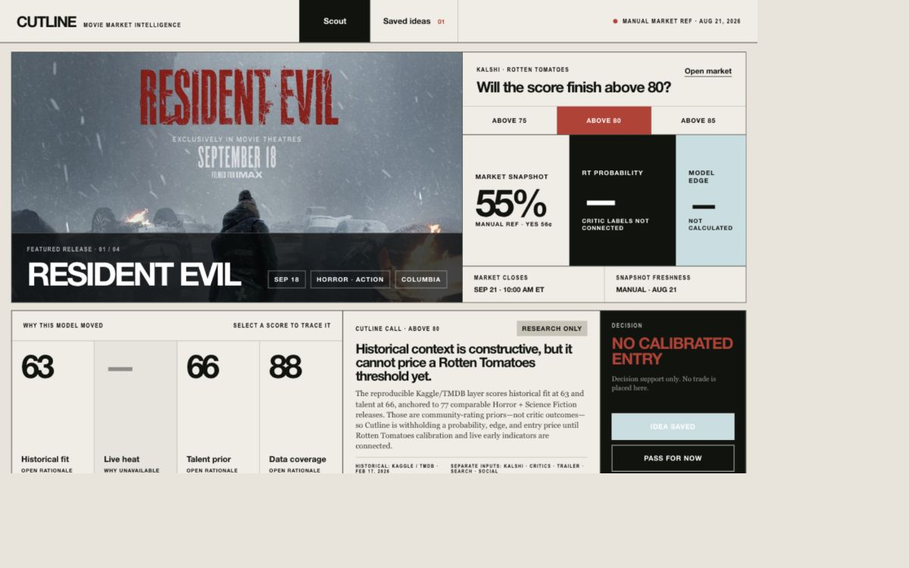
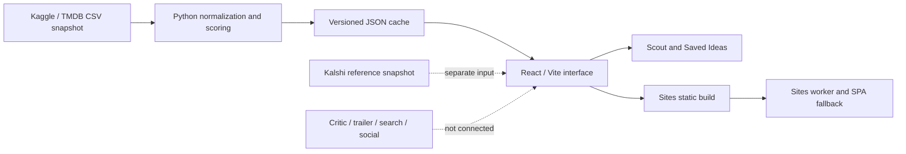

# Cutline

**Explainable movie-market intelligence for researching how upcoming releases may perform.**

Cutline brings a movie, its prediction market, historical evidence, and a research decision into one cinematic desktop frame. Instead of returning a mysterious score, it lets a user open every scored signal and inspect the sample, weights, contribution, freshness, comparable films, and source provenance behind it.

[Current Sites preview](https://cutline-movie-market.cheicolate.chatgpt.site/) · [Architecture](docs/architecture.md) · [Historical methodology](docs/historical-data.md) · [Contributing](CONTRIBUTING.md)

> **Repository status:** `main` contains the reproducible Kaggle/TMDB historical layer. The Sites URL is the canonical hosted prototype, but it may trail `main` until an explicit Sites publish is completed.



## Why Cutline exists

Movie prediction markets are easy to look at and surprisingly hard to reason about. A contract price alone does not explain:

- whether the director, cast, producers, genre, franchise, and release window have useful historical priors;
- how many films support each prior;
- whether a signal is genuinely current or simply stale;
- whether a model is using information that would not have been available before release; or
- why a trade idea should be saved, watched, or passed.

Cutline is designed to make that reasoning visible. It is a research and decision-support product—not an automated trader and not a promise of returns.

## Product experience

The current prototype supports one complete research loop:

1. **Orient on the release.** See the movie art, release context, selected Kalshi threshold, and a clearly labeled manual market snapshot.
2. **Inspect the evidence.** Open Historical fit, Live heat, Talent prior, or Data coverage to trace the underlying evidence.
3. **Read the synthesis.** Cutline explains what the historical layer supports and what it cannot yet conclude.
4. **Make a research decision.** Save the idea or pass without placing a trade.
5. **Revisit saved ideas.** The Saved Ideas view keeps the chosen market threshold and research state in local browser storage.

### Current test case

The first end-to-end case is the Kalshi market for whether **Resident Evil** finishes above a selected Rotten Tomatoes threshold.

| Visible output | Current value | What it means |
| --- | ---: | --- |
| Historical fit | 63.2, displayed as 63 | Weighted historical context from director, producers, franchise, genre cohort, and September releases |
| Live heat | Unavailable | Critic, trailer, search, and social connectors are not configured |
| Talent prior | 65.5, displayed as 66 | Historical prior from first-billed cast, director, and producer filmographies |
| Data coverage | 87.9, displayed as 88 | Availability of the required historical fields; **not** model confidence |
| Rotten Tomatoes probability | Unavailable | The source has TMDB community ratings, not Rotten Tomatoes critic outcomes |
| Model edge / entry | Unavailable | Cutline will not calculate an edge from mismatched outcome labels |

## What is real today

| Surface | Status | Source or storage |
| --- | --- | --- |
| Movie, cast, director, producer, genre, release, budget, revenue, and rating history | Connected historical snapshot | Kaggle/TMDB, February 17, 2026 |
| Historical score calculations | Connected and reproducible | Python standard-library pipeline |
| Comparable-film cohort | Connected | 77 English-language Horror + Science Fiction releases |
| Score rationales | Connected | Checked-in normalized JSON cache |
| Kalshi values | Manual reference snapshot | Displayed separately from historical data |
| Rotten Tomatoes critic outcomes | Not connected | No probability is produced |
| Trailer, search, and social indicators | Not connected | No placeholder values are produced |
| Saved Ideas | Connected locally | Browser `localStorage` |
| Team accounts and shared idea storage | Not connected | No authentication or database exists yet |
| Trade execution | Intentionally unsupported | Decision support only |

This boundary is deliberate. Missing data appears as unavailable; it is never silently replaced with an invented neutral score.

## Historical data and scoring

Cutline uses version 1 of Kaggle's **The Movie Database (TMDB) Comprehensive Dataset**, collected on February 17, 2026.

The audited snapshot contains:

| Table or check | Observed result |
| --- | ---: |
| Raw movie rows | 9,771 |
| Parsed movie rows | 9,770 |
| Cast rows | 150,044 |
| Crew rows | 63,632 |
| Review rows | 13,073, intentionally unused |
| Duplicate valid movie IDs | 0 |
| Orphan cast or crew joins | 0 |
| Malformed movie rows skipped | 1 |

Budget and revenue are missing for roughly 59% of the broader movie table. Cutline therefore exposes financial fields as descriptive comparable-film context rather than quietly treating them as complete predictive inputs.

### Comparable cohort

The Resident Evil cohort contains 77 films that are:

- English-language;
- tagged both `Horror` and `Science Fiction`;
- released from January 1, 2000 through the February 17, 2026 snapshot;
- marked `Released`;
- supported by at least 100 TMDB votes; and
- not the target Resident Evil film.

Ten cohort films are September releases. Forty-eight have both a positive budget and positive revenue, with a median production budget of approximately $34 million and median reported revenue of approximately $68 million. Revenue exceeding production budget is not labeled as profit because marketing and distribution costs are unavailable.

### Historical fit

| Factor | Weight | Sample | Score contribution |
| --- | ---: | ---: | ---: |
| Director prior | 30% | 2 films | 19.2 points |
| Producer prior | 20% | 78 films | 12.8 points |
| Resident Evil franchise prior | 15% | 5 films | 9.6 points |
| Horror + Science Fiction cohort | 25% | 77 films | 15.3 points |
| September release context | 10% | 10 films | 6.3 points |

### Talent prior

| Factor | Weight | Sample | Score contribution |
| --- | ---: | ---: | ---: |
| First four billed cast histories | 50% | 18 films | 33.5 points |
| Director prior | 30% | 2 films | 19.2 points |
| Producer prior | 20% | 78 films | 12.8 points |

Small filmographies and franchise samples use empirical-Bayes shrinkage toward the comparable-cohort mean, equivalent to five prior cohort films. Duplicate films within a factor count once.

### Leakage controls

The scoring pipeline fails closed around information leakage:

- the target film's vote, popularity, review, budget, and revenue fields are not outcomes;
- releases after the dataset snapshot are excluded from historical outcomes;
- TMDB popularity and user-review text are not scoring inputs;
- live market and early-audience signals stay outside the historical layer; and
- no Rotten Tomatoes threshold probability is shown until a real critic-outcome dataset and time-aware validation exist.

The complete source audit, missingness analysis, checksums, licensing review, formulas, and rejected dataset alternatives are in [docs/historical-data.md](docs/historical-data.md).

## System architecture



Cutline currently has two backend-like surfaces:

1. `scripts/historical_model.py` is the deterministic batch data and scoring layer.
2. `worker/index.js` is the Sites hosting worker that serves static assets and browser-route fallbacks.

There is no live application API, scheduler, database, authenticated account layer, or trade-execution service yet. The recommended boundaries for adding them are documented in [docs/architecture.md](docs/architecture.md).

## Repository map

```text
cutline-movie-market/
├── .github/workflows/ci.yml       # GitHub verification on pushes and PRs
├── .openai/hosting.json           # Canonical Sites project binding
├── public/assets/                 # Movie artwork
├── src/
│   ├── App.jsx                    # Scout, score drawers, decisions, Saved Ideas
│   ├── styles.css                 # Editorial cinematic design system
│   └── data/
│       └── resident-evil-historical.json
├── scripts/
│   ├── historical_model.py       # Normalization, audit, cohorts, and scores
│   ├── build_historical_model.py # Cache build entry point
│   ├── download_kaggle_data.sh   # Checksummed dataset download and rebuild
│   └── prepare-sites-build.mjs   # Sites packaging step
├── tests/
│   ├── test_historical_model.py  # Scoring and leakage tests
│   └── sites-worker.test.mjs     # Sites runtime contract tests
├── worker/index.js               # Sites asset and SPA fallback worker
├── docs/                         # Architecture, methodology, and QA evidence
├── AGENTS.md                     # Codex product and implementation rules
├── CLAUDE.md                     # Claude Code handoff guidance
└── CONTRIBUTING.md               # Team contribution workflow
```

## Getting started

### Requirements

- Node.js 22 or newer recommended
- npm 10 or newer
- Python 3.10 or newer for historical-data tests and rebuilds

### Clone and run

```bash
git clone https://github.com/CheickDiakite-yikes/cutline-movie-market.git
cd cutline-movie-market
npm ci
npm run dev
```

Normal frontend development uses the checked-in normalized cache, so a Kaggle account or raw-data download is not required.

### Verify the full project

```bash
npm test
```

`npm test` runs the historical scoring/leakage tests, builds the Sites package, and verifies the Sites worker contract.

## Command reference

| Command | Purpose |
| --- | --- |
| `npm run dev` | Start the local Vite development server |
| `npm run build` | Build the frontend and prepare the Sites artifact layout |
| `npm run preview` | Preview the production Vite build locally |
| `npm run test:historical` | Run scoring, shrinkage, provenance, and leakage tests |
| `npm run test:sites` | Test the Sites worker and required build files |
| `npm test` | Run the complete verification suite |
| `npm run data:historical` | Rebuild the normalized cache from existing raw CSVs |
| `bash scripts/download_kaggle_data.sh` | Download, checksum, unzip, normalize, and rebuild the audited dataset |

## Rebuilding the historical cache

Raw Kaggle archives and CSV files are intentionally gitignored. The small normalized cache required by the UI and CI is committed.

To download the audited archive and rebuild everything:

```bash
bash scripts/download_kaggle_data.sh
```

The script verifies the observed version-1 archive SHA-256 checksum before using it. If Kaggle serves a different archive, the command stops. A changed source must be re-audited for provenance, license, schema, missingness, and leakage before replacing the cache.

If the CSV files already exist in `data/raw/tmdb-comprehensive-v1`:

```bash
npm run data:historical
```

Do not hand-edit computed values inside `src/data/resident-evil-historical.json`.

## Sites and other environments

### Sites

The production build preserves the Sites artifact contract:

```bash
npm run build
npm run test:sites
```

The build must emit:

```text
dist/client/index.html
dist/server/index.js
dist/.openai/hosting.json
```

`.openai/hosting.json` points to the canonical Cutline Sites project. Teammates should create or select their own Sites project before publishing a fork. Do not overwrite the canonical deployment without explicit authorization.

### Other static hosts

The frontend can run anywhere that serves `dist/client` and routes unknown browser paths back to `index.html`. The historical model is already compiled into a small JSON asset, so the current prototype does not require a long-running Python process in production.

### Claude Code, Codex, and ordinary editors

The repository is environment-independent for normal development:

- Claude Code contributors should begin with [CLAUDE.md](CLAUDE.md).
- Codex contributors should follow [AGENTS.md](AGENTS.md).
- Contributors using an ordinary editor can follow this README and [CONTRIBUTING.md](CONTRIBUTING.md).

All environments should preserve the same contracts: standard React/Vite/Python workflows, reproducible data, truthful unavailable states, Saved Ideas behavior, and Sites packaging.

## Adding a live backend

The current code is intentionally structured so a team can add live services without rewriting the product interface.

Recommended layers:

1. **Market adapter** — fetch and timestamp Kalshi price, volume, status, close time, and contract metadata.
2. **Critic outcome store** — preserve time-stamped Rotten Tomatoes observations and final outcomes for calibration.
3. **Early-signal jobs** — collect trailer, search, and social observations with provider, query, geography, window, and freshness metadata.
4. **Scoring service** — version feature definitions, weights, transformations, and contribution traces.
5. **Idea store** — replace local browser storage only after team identity and access rules are defined.
6. **Scheduler and alerts** — recompute after validated source updates and notify under explicit user rules.

Every live response should preserve at least:

```text
source
observed_at
freshness_status
sample_size
feature_version
model_version
contributions
unavailable_fields
```

A connector failure must not silently reuse stale data as current.

## Testing and continuous integration

GitHub Actions runs `npm ci` followed by `npm test` on every push to `main` and every pull request.

The current suite verifies:

- empirical-Bayes shrinkage;
- declared score weights and contributions;
- exclusion of target and post-snapshot outcomes;
- minimum-vote and release-status eligibility;
- provenance and license fields in the checked-in cache;
- absence of fabricated Rotten Tomatoes probability output;
- Sites asset serving and SPA fallbacks;
- correct 404 behavior for unavailable APIs and write requests; and
- required Sites packaging files.

Visible UI changes should also be checked in a real browser at the 1440 × 900 desktop target, including threshold switching, all score drawers, Save, Remove, Pass, Saved Ideas, layout overflow, and console errors.

## Contribution workflow

1. Create a focused branch from `main`.
2. Keep raw datasets, build output, credentials, and unrelated files out of commits.
3. Add or update tests when changing calculations, eligibility, cohorts, weights, or hosting behavior.
4. Run `npm test` before opening a pull request.
5. Explain which source dates, truth boundaries, and browser states changed.

See [CONTRIBUTING.md](CONTRIBUTING.md) for the full review checklist.

## Product guardrails

- Cutline is decision support, not financial advice.
- It does not place trades.
- Historical TMDB community ratings are not Rotten Tomatoes critic scores.
- Data coverage is not prediction confidence.
- Missing and stale signals must remain visible.
- No return, score, sample, or source should be invented.
- The canonical Sites project must not be published over without authorization.

## Licensing and attribution

This repository is currently a private, non-commercial team prototype. No general open-source license has been granted for the application code.

The normalized historical cache is derived from Kaggle's **The Movie Database (TMDB) Comprehensive Dataset**, licensed **CC BY-NC-SA 4.0**. This product uses TMDB data but is not endorsed or certified by TMDB.

Read [docs/historical-data.md](docs/historical-data.md) before redistributing the data, replacing the dataset, or changing the project's commercial status.

## Further documentation

- [System architecture and live-backend extension boundaries](docs/architecture.md)
- [Historical source audit, methodology, missingness, and leakage controls](docs/historical-data.md)
- [Browser and visual QA evidence](design-qa.md)
- [Claude Code guidance](CLAUDE.md)
- [Codex project instructions](AGENTS.md)
- [Contribution guide](CONTRIBUTING.md)
